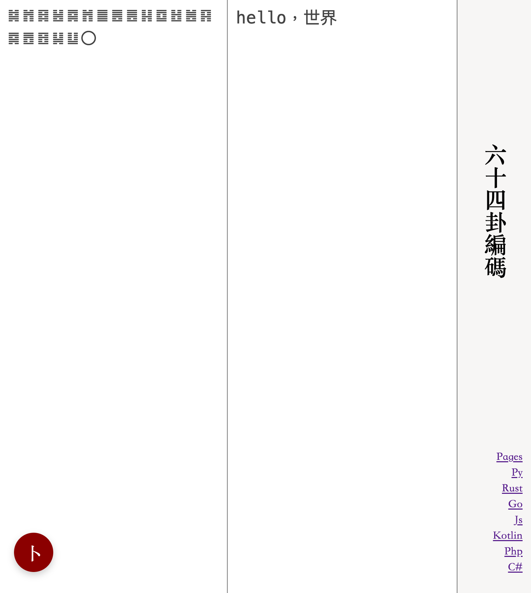

# 六十四卦編碼

六十四卦編碼，golang實現

如：“hello，世界”会編碼為“䷯䷬䷿䷶䷸䷬䷀䷌䷌䷎䷼䷲䷰䷳䷸䷘䷔䷭䷒〇”

[go-gua64](https://github.com/lizongying/go-gua64)

[demo](https://lizongying.github.io/js-gua64/)



## All language

* [rust](https://github.com/lizongying/rs-gua64)
* [golang](https://github.com/lizongying/go-gua64)
* [js](https://github.com/lizongying/js-gua64)
* [java](https://github.com/lizongying/java-gua64)
* [php](https://github.com/lizongying/php-gua64)
* [python](https://github.com/lizongying/pygua64)
* [c#](https://github.com/lizongying/dotnet-gua64)

## Download

[releases](https://github.com/lizongying/go-gua64/releases/latest)

## History

[History](./HISTORY.md)

## Usage

* -e Input the string to be encoded
    ```shell
    gua64 -e 123   
    # output: ䷽䷺䷎䷼
    ```
* -d Input the string to be decoded
    ```shell
    gua64 -d ䷽䷺䷎䷼   
    # output: 123
    ```
* -v Input the string and judge whether it is gua64
    ```shell
    gua64 -v ䷽䷺䷎䷼   
    # output: true
    ```
* -o Specify the path of the output file
    ```shell
    gua64 -e 123 -o encode.txt   
    ```

* -f Indicate whether the input is a file
    ```shell
    gua64 -f -d encode.txt -o decode.txt  
  
    gua64 -f -d decode.txt -o encode.txt    
    ```

* -h Show help information
    ```shell
    gua64 -h 
    ```

* -version Show version information
    ```shell
    gua64 -version
    ```

## Build

```shell
make
```

## Docker image

[ghcr.io](https://github.com/lizongying/go-gua64/pkgs/container/go-gua64)

[hub.docker.com](https://hub.docker.com/r/lizongying/go-gua64)

## Some sample in Golang

[sample](./sample)

### Document

[document](https://pkg.go.dev/github.com/lizongying/go-gua64)

### Install

```
go get github.com/lizongying/go-gua64
```

```go
package main

import (
	"fmt"
	"github.com/lizongying/go-gua64/gua64"
)

// go run sample/main.go
func main() {
	g := gua64.NewGua64()
	fmt.Println(g.Encode([]byte(`hello，世界`)))
	fmt.Println(string(g.Decode(`䷯䷬䷿䷶䷸䷬䷀䷌䷌䷎䷼䷲䷰䷳䷸䷘䷔䷭䷒〇`)))
	fmt.Println(g.Verify(`䷯䷬䷿䷶䷸䷬䷀䷌䷌䷎䷼䷲䷰䷳䷸䷘䷔䷭䷒〇`))
}
```

## 讚賞

